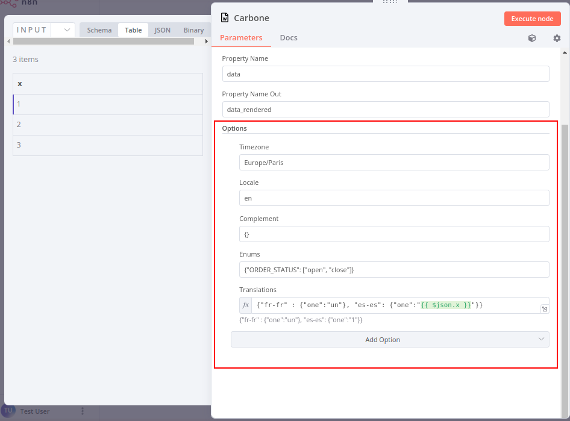
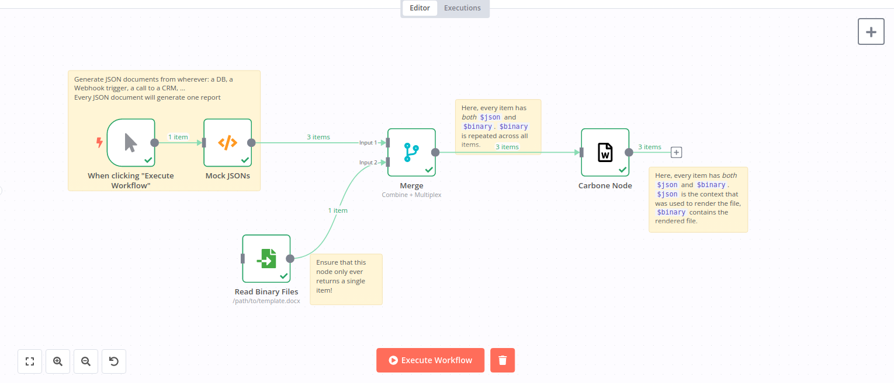
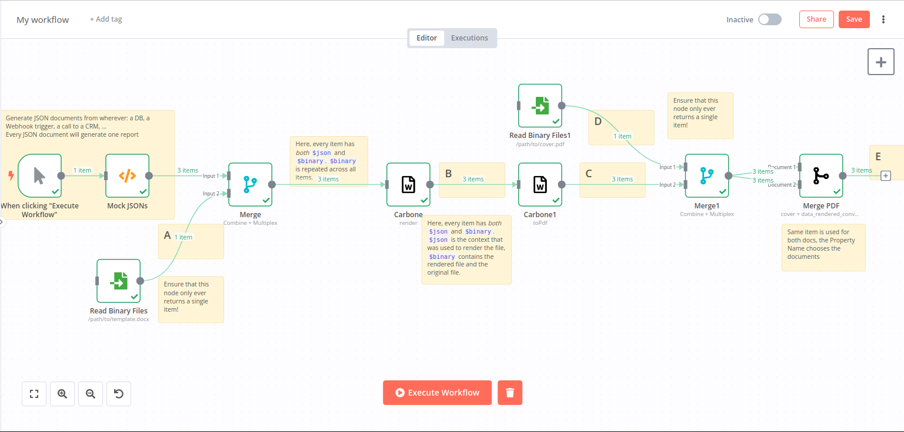
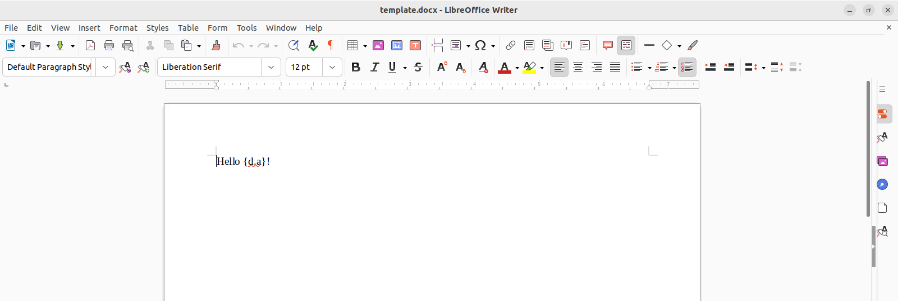
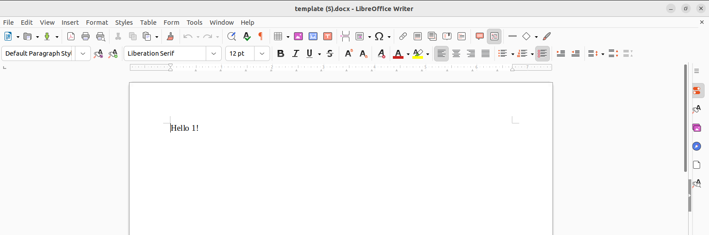
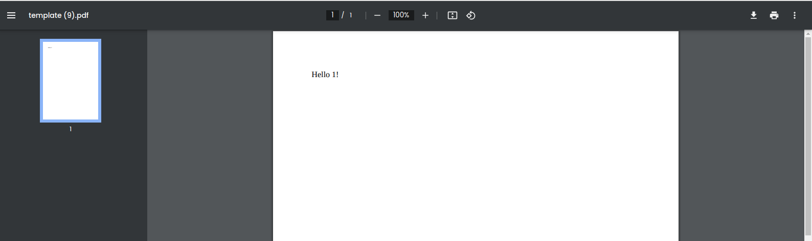
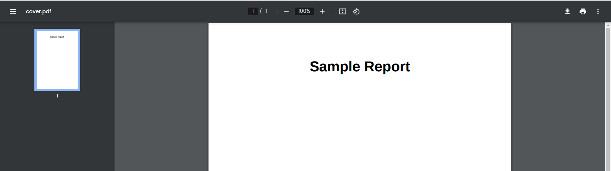
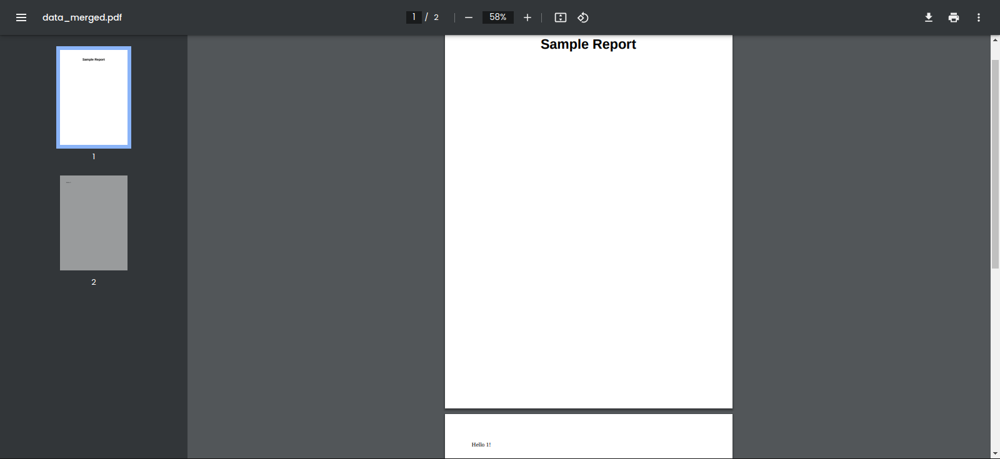
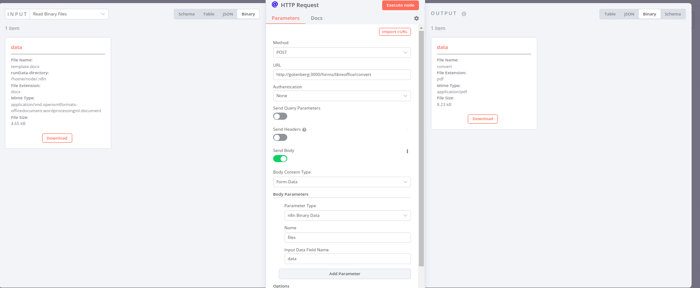
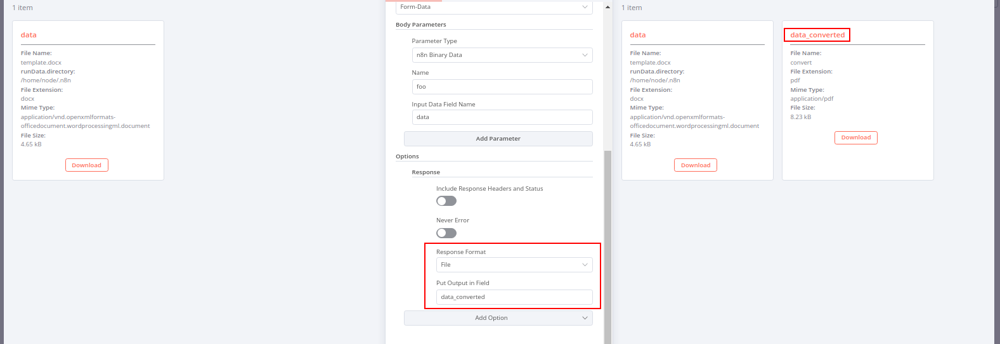

# n8n-nodes-carbonejs

> [!TIP]
> If you're interested in generating documents using N8N from a Word/Excel/Powerpoint template, you may also be
> interested [in the `n8n-nodes-docxtemplater` node](https://github.com/jreyesr/n8n-nodes-docxtemplater), which
> uses [Docxtemplater](https://docxtemplater.com/) as the rendering engine.
>
> Docxtemplater has a different syntax for filters/formatters and its node has more configurable options than this one.
> It allows you to write your own Transforms (the equivalent to
> Carbone's [Formatters](https://carbone.io/documentation/design/formatters/overview.html)) by using
> [N8N's tool-calling functionality, commonly used on LLMs](https://docs.n8n.io/integrations/builtin/cluster-nodes/sub-nodes/).
> It also allows you to
> define [custom data sources](https://docxtemplater.com/docs/async/#code-for-async-data-resolution) that are called
> _while_ the document is rendering, as opposed to the standard JSON object that must be available before the document
> is even read. It also supports [Docxtemplater Modules](https://docxtemplater.com/modules/), which add functionality
> such as image rendering or more ways to generate tables, and can be bought from Docxtemplater or developed separately.

This is an n8n community node. It lets you use [the Carbone JS library](https://carbone.io/) in your n8n workflows.

Carbone is a report generator that lets you render JSON data into DOCX, PDF, XLSX and more formats:


[n8n](https://n8n.io/) is a [fair-code licensed](https://docs.n8n.io/reference/license/) workflow automation platform.

> **NOTE:** Carbone is licensed under
> the [Carbone Community License (CCL)](https://github.com/carboneio/carbone/blob/master/LICENSE.md), which says that "
> Roughly speaking, as long as you are not offering Carbone Community Edition Software as a hosted
> Document-Generator-as-a-Service like Carbone Cloud, you can use all Community features for free.". AFAICT, this means
> that this plugin must also be distributed under CCL, and that you can't install it in a N8N instance and then use it
> to
> provide document generation as a service. You can use it for "your own internal business purposes" and "value-added
> products or services", as long as they aren't primarily document generation services.

[Installation](#installation)  
[Operations](#operations)  
[Compatibility](#compatibility)  
[Usage](#usage)  <!-- delete if not using this section -->  
[Resources](#resources)

## Installation

Follow the [installation guide](https://docs.n8n.io/integrations/community-nodes/installation/) in the n8n community
nodes documentation.

## Operations

### Render Document

Must receive an input item with both `$json` and `$binary` keys. The `$json` key may be used to compose the "context",
which will be provided to the templating engine. The `$binary` key should contain a DOCX document that contains a valid
Carbone template.

This operation can take "advanced options", which are passed directly to Carbone's rendering engine.
See [Carbone's docs](https://carbone.io/api-reference.html#options) for information about each option. They appear in
the Options dropdown, at the bottom of the Render operation:



### Convert to PDF

> **NOTE:** This operation requires LibreOffice to be installed. If using the native NPM install, you should install
> LibreOffice system-wide. If using the Docker images, this operation doesn't seem to work :(

This node must receive items with a binary property containing a DOCX document. The selected document will be rendered
into a PDF file using the LibreOffice renderer,
since [according to one of the Carbone authors](https://github.com/carboneio/carbone/issues/41#issuecomment-528573164), "
I tried to avoid LibreOffice because I wanted a tool really light and highly performant. But after many researches, I
have never found a solution to convert a document more reliable than LibreOffice and which can run everywhere."

### Merge PDFs

This node takes two inputs, like
the [Merge node](https://docs.n8n.io/integrations/builtin/core-nodes/n8n-nodes-base.merge/). Unlike the merge node, both
inputs _must_ have the same amount of elements. The node will output a stream with the same amount of items, where every
output item is the result of merging one element from `Input 1` and one element from `Input 2`, by position (i.e., first
with first, second with second, and so on).

## Compatibility

This plugin has been developed and tested on N8N version 0.228.2. It should work with older versions too, but it hasn't
been tested.

## Usage

### Basic usage: render to a DOCX file

The `Render` node needs to receive data items with _both_ JSON
and [binary data](https://docs.n8n.io/courses/level-two/chapter-2/#binary-data). The binary data is the template, and
the JSON data will be the context passed to the template.

To generate these data items, you'll probably want to use
a [Merge Node](https://docs.n8n.io/integrations/builtin/core-nodes/n8n-nodes-base.merge), with Mode set to **Combine**
and Combination Mode set to **Multiplex**. This generates a cross-join of all data in Input A and Input B (i.e., every
possible combination of items). If you only input _one_ item in the template, you'll get one item out for each different
JSON context.

See below for an example:



The Merge node receives 3 items in its Input A, and 1 item in its input B. Every possible combination yields 3*1 = 3
output combinations, each with the same template but different JSON content.

The data items output by the node will also have JSON and binary data. The JSON data is the context that was used for
rendering the document (which is not necessarily the same as the node's input `$json` key), and the binary data is
another DOCX document, rendered from the input Template.

### Complicated usage: render, convert to PDF, then add a static "cover page"



The workflow above is a more complicated version of the workflow, which uses everything that this node provides:

1. The rendering part is the same as above: the JSON contexts are generated somehow, the template is read from disk and
	 replicated on every context, and then the Carbone node is used to render the documents
1. Every rendered document is converted to PDF
1. A "cover page" (a static PDF document) is read from disk and replicated on every PDF document (using the same Merge
	 pattern as in the Simple Example above)
1. The Merge PDF node is used to add the cover letter at the start of every PDF document

Here's how the data looks at different points in the path (look for the yellow notes with letters):

A. The original template, which refers to a property in the context called `a`. Imagine that it's, say, the name of a
user.



B. The document after being rendered, here with the context `{"a": 1}`



C. The same document, converted to a PDF file



D. The "cover page"



E. The document, now with the cover page added. Note that it has two pages, coming from two different documents



## Resources

* [n8n community nodes documentation](https://docs.n8n.io/integrations/community-nodes/)
* [General Carbone docs](https://carbone.io/documentation.html)
* [A short tutorial on template design](https://help.carbone.io/en-us/article/how-to-create-a-template-nm284z)
* [Detailed docs on template design](https://carbone.io/documentation.html#design-your-first-template)

## Usage with Docker

> **NOTE:** As of now, I haven't been able to make Carbone work with LibreOffice in Docker, so it probably won't work
> with N8N Docker deployments. If you manage to make it work, please open an issue!
>
> As of now, if you need to convert rendered documents to PDF, I recommend either a) using native (NPM) deployments for
> N8N, o b) using a standalone Docker container that exposes some sort of REST API, deploying it alongside the N8N
> container, and using
> the [HTTP Request node](https://docs.n8n.io/integrations/builtin/core-nodes/n8n-nodes-base.httprequest/) to interface
> with it.
>
> May I suggest [Gotenberg](https://github.com/gotenberg/gotenberg), just for the awesome portrait of a Gutenberg
> gopher? Note that I can't vouch for the security of that service, but it seems legit and active.

Using the node with a native N8N instance (i.e., [one installed with
`npm`](https://docs.n8n.io/hosting/installation/npm/)) is relatively easy: install LibreOffice using the OS's utilities,
if required (e.g. `apt install libreoffice-common` on Ubuntu), then install the node with `npm` or using the N8N UI, and
then use it.

[Docker deployments](https://docs.n8n.io/hosting/installation/docker/) add some complexity, since you can't necessarily
rely on the NPM packages persisting across container restarts, ~~and you need to install the LibreOffice package, if
required, in the container image, not on your host OS~~.

Here's a checklist of changes that are required to make the node work on Docker deployments:

- [ ] Ensure that the `/home/node/.n8n` directory (on the container) is mapped to a volume. If using plain Docker, use
	`-v host_dir_or_vol_name:/home/node/.n8n` as part of the `docker run` command (note that
	N8N's [Docker quickstart](https://docs.n8n.io/hosting/installation/docker/#starting-n8n) already does this, and maps
	that folder to `~/.n8n` on your host device). If using Docker Compose, ensure that you have an entry under the
	`volumes` array that has `- host_dir_or_vol_name:/home/node/.n8n` as its value
- [ ] Install the node as normal (i.e. by going to the `Settings>Community Nodes` page and searching for
	`n8n-nodes-carbonejs`). Ensure that the node appears in the host-mapped volume, under the `node_modules` directory.
- [ ] ~~If you wish to use the Convert to PDF action, you'll additionally need to add the LibreOffice system library to
	the Docker image and recompile it.~~
	- [ ] ~~Create a `Dockerfile` with the following contents:~~
		```Dockerfile
		FROM n8nio/n8n:latest

		RUN apk --update --no-cache --purge add libreoffice-common
		```
	- [ ] ~~If using plain Docker, run `docker build . -t n8nio/n8n:latest-libreoffice`~~
	- [ ] ~~From there on, run N8N as `docker run <...> n8nio/n8n:latest-libreoffice`~~
	- [ ] ~~If using Docker Compose, change the service declaration:~~
		```yml
		services:
		  n8n:
		    image: n8nio/n8n:latest-libreoffice  # Declare a new tag
		    build: .  # Add this line
		```
	- [ ] ~~From there on, run `docker-compose build` before running `docker-compose up`, or use `docker-compose up -b`~~
	- [ ] ~~Whenever you need to update the N8N version, remember to run `docker pull n8nio/n8n:latest` first, as
		otherwise the build process will use a cached base image~~

### A workaround for converting DOCX files to PDF on Docker

Since the LibreOffice-Carbone-N8N-Alpine stack is currently not working, I'd recommend using a standalone dedicated
container to do DOCX→PDF conversions, in the spirit of small, dedicated microservices and such.

A cursory Google search turns up [Gotenberg](https://github.com/gotenberg/gotenberg), "A Docker-powered stateless API
for PDF files." As usual, do your own research, deploying untrusted containers may make your lunch disappear, and all
the usual warnings.

See [their docs](https://gotenberg.dev/docs/get-started/docker-compose) for Docker Compose information:

```yml
services:
	# Your other services (i.e. N8N)

	gotenberg:
		image: gotenberg/gotenberg:7
```

Then, use [the LibreOffice module](https://gotenberg.dev/docs/modules/libreoffice#route) to convert files:

1. Create a [HTTP Request node](https://docs.n8n.io/integrations/builtin/core-nodes/n8n-nodes-base.httprequest/) in the
	 N8N workflow
1. Set the method to `POST`
1. Set the URL to `http://gotenberg:3000/forms/libreoffice/convert`
1. Enable the `Send Body` toggle
1. Set the Body Content Type to `Form-Data`
1. Set the Parameter Type of the first Body parameter to `n8n Binary Data`
1. Set the Name to `files` (it looks like it could also be something else, but set it to `files` just to match the
	 Gotenberg docs)
1. Set the Input Data Field Name to the name of the binary field holding the DOCX file (could be `data`)

See below for a screenshot of a working configuration:



By default, this configuration will override the incoming file with the response's (PDF) file. If you wish to preserve
both files:

1. In the HTTP Request node, click the Add Option button at the bottom, then click the Response option
1. In the new section that appears, set the Response Format to `File`
1. In the new Put Output in Field textfield that appears, set it to a name that is different to the name of the input
	 file (e.g., if the input file is in `data`, set it to `data_pdf` or something)



## Development

More information [here](https://docs.n8n.io/integrations/creating-nodes/test/run-node-locally/).

You must have a local (non-Docker) installation of N8N.

1. Clone this repo
1. `npm i`
1. Make changes as required
1. `npm run build`
1. `npm link`
1. Go to N8N's install dir (`~/.n8n/custom/` on Linux), then run `npm link n8n-nodes-carbonejs`
1. `n8n start`. If you need to start the N8N instance on another port, `N8N_PORT=5679 n8n start`
1. There's no need to visit the web UI to install the node: it's already installed since it lives in the correct
	 directory
1. After making changes in the code and rebuilding, you'll need to stop N8N (Ctrl+C) and restart it (`n8n start`)
1. For faster changes, instead of rebuilding the code each time, run `npm run dev`. This will start the TypeScript
	 compiler in watch mode, which will recompile the code on every change. You'll still need to restart N8N manually,
	 though.

### Small-scale release for single person

Use when someone has reported an issue, to give that person a way to test the fix
without having to release a version that may not fix their issue. Especially useful
when the issue can't be reproduced locally.

1. Temporarily edit the `package.json` file to another version, e.g. `v1.2.3-bugfix123`
2. Run `npm ci && npm run build && npm publish --tag prerelease`
3. This will build and upload a new release to NPM, _without marking it_ as the latest release! This is important
	 because otherwise other users of the node will start getting prompts to update their installations, which isn't
	 correct
4. Tell the user that may be interested in testing the changes to force-install that new version
5. If/when the user confirms that the version fixes the issue, release for everyone: [see below](#releasing-changes)

### Releasing changes

- [ ] Bump the version in `package.json`. We use [SemVer](https://semver.org/).
- [ ] Add an entry to the top of `CHANGELOG.md` describing the changes.
- [ ] Push changes, open a PR and merge it to master branch (if developing on another branch)
- [ ] Create a release. This will kick off the CI which will build and publish the package on NPM
